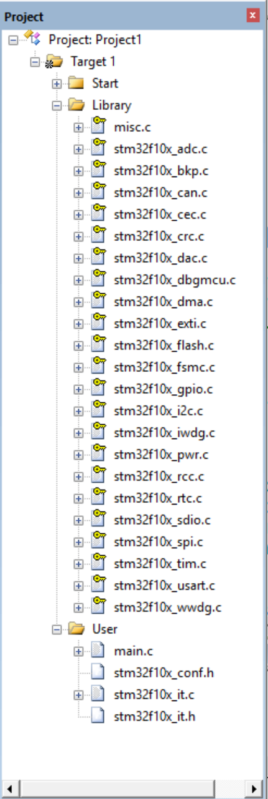
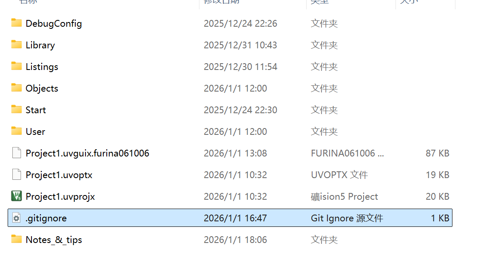

# 练习过的代码以及笔记
> 此project是新手跟着`江协科技`学习而做的,此markdown扮演了一种留存代码和笔记的角色
## 目录
- [练习过的代码以及笔记](#练习过的代码以及笔记)
  - [目录](#目录)
  - [点灯小弟](#点灯小弟)
    - [代码结构](#代码结构)
    - [keil5软件功能](#keil5软件功能)
## 点灯小弟
```c
#include "stm32f10x.h"                  // Device header
 
 int main(void)
 {
	RCC_APB2PeriphClockCmd(RCC_APB2Periph_GPIOC, ENABLE);
	GPIO_InitTypeDef GPIO_InitStructure;
	GPIO_InitStructure.GPIO_Mode = GPIO_Mode_Out_PP;
	GPIO_InitStructure.GPIO_Pin = GPIO_Pin_13;
	GPIO_InitStructure.GPIO_Speed = GPIO_Speed_50MHz;
	GPIO_Init(GPIOC,&GPIO_InitStructure);
//	GPIO_SetBits(GPIOC, GPIO_Pin_13);
	GPIO_ResetBits(GPIOC, GPIO_Pin_13);
	while(1)
	{
		
	}
 }
 
```
今天功能实现上了解不算多,主要是摸索了些Keil5的软件功能,话不多说,上笔记!  :
### 代码结构
- 首先是`#include "stm32f10x.h"`,它是一个总的头文件,意思是里头有含一段 :
```C 
#ifdef USE_STDPERIPH_DRIVER//这里的`USE_STDPERIPH_DRIVER`,即使用标准外设
// 需要用keil5的魔术棒-> C\C++ -> define 填写`USE_STDPERIPH_DRIVER`,以全局宏定义`USE_STDPERIPH_DRIVER`,避免在不同源程序文件里重复定义,麻烦
  #include "stm32f10x_conf.h"
#endif
```
然后我们再打开这个`stm32f10x_conf.h`,里面会含一段 :
```C
/* Includes ------------------------------------------------------------------*/
/* Uncomment/Comment the line below to enable/disable peripheral header file inclusion */
#include "stm32f10x_adc.h"
#include "stm32f10x_bkp.h"
#include "stm32f10x_can.h"
#include "stm32f10x_cec.h"
#include "stm32f10x_crc.h"
#include "stm32f10x_dac.h"
#include "stm32f10x_dbgmcu.h"
#include "stm32f10x_dma.h"
#include "stm32f10x_exti.h"
#include "stm32f10x_flash.h"
#include "stm32f10x_fsmc.h"
#include "stm32f10x_gpio.h"
#include "stm32f10x_i2c.h"
#include "stm32f10x_iwdg.h"
#include "stm32f10x_pwr.h"
#include "stm32f10x_rcc.h"
#include "stm32f10x_rtc.h"
#include "stm32f10x_sdio.h"
#include "stm32f10x_spi.h"
#include "stm32f10x_tim.h"
#include "stm32f10x_usart.h"
#include "stm32f10x_wwdg.h"
#include "misc.h" /* High level functions for NVIC and SysTick (add-on to CMSIS functions) */
```
这便是所有的标准库头文件了,这就是一个头文件能让我们使用所有标准库头文件的原因

- 每个函数的功能暂时还是不太清楚,但是幸亏跟着`江协科技`掌握了查找函数定义和应用的方法,~~这个是很基础的,只是我第一次知道这些~~
***
### keil5软件功能
- #### 项目视图(project view)

这个视图我目前只知道两大作用 :
- **文件可视化** :
我向这个工程里加入了什么文件,这在我们了解我们需要和查找哪些文件时显得格外方便 

- **文件编译** :
keil5会把加入到项目视图的特定类型文件（比如`.c`）在构建`build`时一起进行编译
> 这里最需要注意的,`头文件.h`不包括在内
> 所以我们要自己把含`头文件`的文件夹加入环境变量`include path`内


>关于项目视图,我一开始最不理解的,我以为它真的自己又建了个真实文件夹。实则不然，这个只起到可视化的作用，并不存在这些文件夹，充其量只有每个文件的地址？
真正的文件还在总工程文件夹里

诺，就是这里的.\Start :.\User :.\Library,**这几个文件夹都是我自己额外建的，和project view没有一点关系**